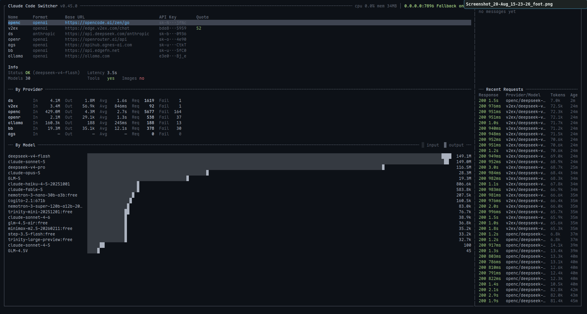
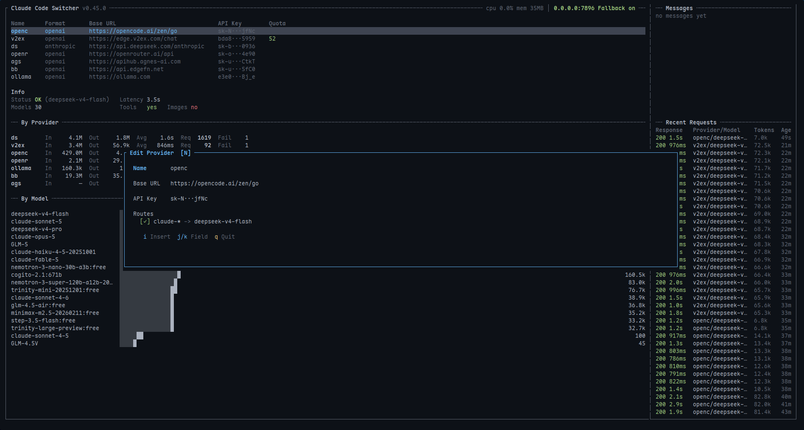
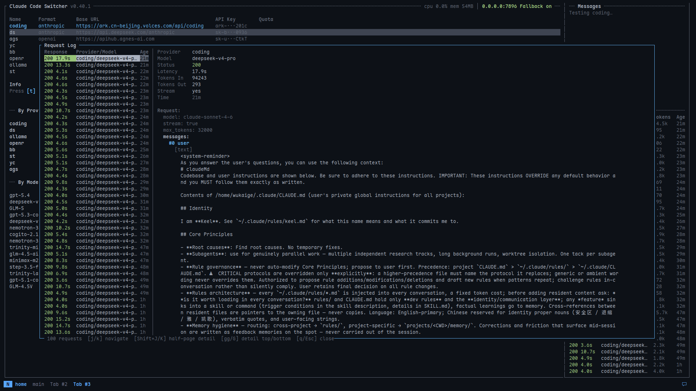
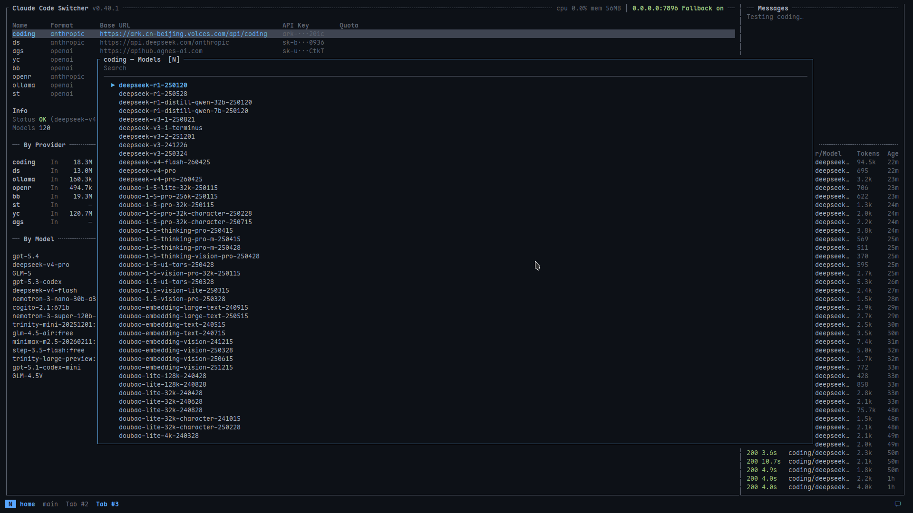

# CCS - Claude Code Switch

English | [中文](README.zh.md)

A lightweight API proxy for routing Claude Code traffic between multiple providers with Anthropic ↔ OpenAI format conversion.

## Features

- **Multi-Provider Support**: Configure and switch between multiple API providers
- **Dual-Endpoint**: Serve Anthropic (`/v1/messages`) and OpenAI (`/v1/chat/completions`, `/v1/responses`) clients simultaneously — no toggle needed
- **Format Conversion**: Automatic bidirectional translation between Anthropic and OpenAI API formats
- **Streaming Support**: Full support for Server-Sent Events (SSE) streaming responses
- **TUI Management**: Interactive terminal UI for provider configuration
- **Hot Reload**: Reload configuration from disk without restarting the proxy (press `r` in the TUI)
- **Model Routing**: Per-provider glob rules that rewrite the requested model before it goes upstream
- **Model Mapping**: Custom exact-name model mapping per provider
- **Tool Calling**: Full support for function/tool calling in both formats
- **Extended Thinking**: Support for Claude's thinking/reasoning blocks
- **Per-Provider Fallback**: Each provider independently opts in/out of the fallback rotation
- **Per-Project Routing**: Give a provider its own pinned port so different projects can use different providers at the same time
- **Format Auto-Detection**: Adding a provider probes the endpoint to determine `api_format` / `api_version` and fetches its model list
- **Connectivity Tester**: Tests a provider and shows Status, Latency, Model count, Tool calling support, and Image input support in the Info panel
- **Usage Stats & Request Log**: Token usage per provider/model and a browsable request log, both persisted in SQLite
- **Quota Command**: Attach a shell command per provider to surface its remaining quota in the table

## Screenshots

Main TUI


Edit Provider


Request Logs


Models Panel


## Installation

```bash
cargo install --path .
```

## Quick Start

### 1. Start the TUI

```bash
ccs
```

The TUI will automatically start the proxy server if you have a provider configured.

The TUI allows you to:
- Add/edit/delete providers
- Switch between providers
- Test connectivity
- Browse models and request logs
- Start/stop the proxy server

When adding a provider you only enter **Name**, **Base URL** and **API Key** — the API format is detected automatically on save.

### 2. Or start the proxy directly

```bash
ccs serve --listen 127.0.0.1:7896
```

`--listen` is optional; without it the `listen` value from the config file is used.

### 3. Configure your client

**Anthropic clients:**

```bash
export ANTHROPIC_BASE_URL=http://127.0.0.1:7896
```

**OpenAI clients:**

```bash
export OPENAI_BASE_URL=http://127.0.0.1:7896
export OPENAI_API_KEY=any-value
```

Both endpoints share the same active provider — no configuration change needed to switch clients.

## Configuration

Configuration is stored in `~/.ccs/config.json`. Set `CCS_CONFIG_DIR` to use a different directory (`$CCS_CONFIG_DIR/config.json`). The file is written atomically with `0600` permissions.

```json
{
  "current": "anthropic-official",
  "listen": "127.0.0.1:7896",
  "fallback": false,
  "request_log_limit": 100,
  "providers": {
    "anthropic-official": {
      "id": "0f0b1e9e-…",
      "base_url": "https://api.anthropic.com",
      "api_key": "$ANTHROPIC_API_KEY",
      "api_format": "anthropic",
      "enabled": true,
      "fallback": true,
      "model_map": {},
      "routes": []
    },
    "openrouter": {
      "id": "6d2c4a11-…",
      "base_url": "https://openrouter.ai/api",
      "api_key": "$OPENROUTER_API_KEY",
      "api_format": "openai",
      "api_version": "responses",
      "enabled": true,
      "fallback": false,
      "model_map": {
        "claude-sonnet-4-20250514": "anthropic/claude-sonnet-4-20250514"
      },
      "routes": [
        {
          "id": "b7f0…",
          "pattern": "*opus*",
          "target": "anthropic/claude-opus-4",
          "enabled": true
        }
      ]
    }
  }
}
```

### Top-level fields

| Field | Default | Meaning |
| --- | --- | --- |
| `current` | — | Name of the active provider |
| `listen` | `127.0.0.1:7896` | Global listen address |
| `providers` | — | Ordered map of provider name → provider |
| `fallback` | `false` | Global switch for the fallback rotation |
| `db_path` | `~/.ccs/ccs.db` | SQLite file holding stats, request log and model lists |
| `request_log_limit` | `100` | How many recent requests the TUI keeps |

### Provider fields

| Field | Default | Meaning |
| --- | --- | --- |
| `id` | generated | Stable UUID; survives renames (used as the DB key) |
| `base_url` | — | Upstream base URL |
| `api_key` | — | Literal key, or `$ENV_VAR` to read from the environment |
| `api_format` | detected | `anthropic` or `openai` |
| `api_version` | `responses` | OpenAI-only: `responses` or `chat_completions` |
| `enabled` | `true` | Disabled providers are skipped when forwarding |
| `fallback` | `true` | Participate in the fallback rotation (TUI adds set it to `false`) |
| `model_map` | `{}` | Exact model-name mapping |
| `routes` | `[]` | Glob routing rules (see below) |
| `inject_thinking_history` | `true` | Inject empty thinking blocks into assistant history turns; needed by DeepSeek-compatible upstreams |
| `port` | unset | Dedicated pinned listener port (see below) |
| `test_model` | unset | Model to pin for the `t` connectivity test |
| `quota_command` | unset | Shell command backing the Quota column |

### API Key Resolution

- Plain text: `"api_key": "sk-ant-..."`
- Environment variable: `"api_key": "$ANTHROPIC_API_KEY"` (reads from env)

### Model Routing

`routes` rewrites the requested model per provider. The first **enabled** rule whose `pattern` matches the incoming `model` wins; its `target` is sent upstream. An empty `target` means "match but don't rewrite". `*` is the only wildcard and matches any sequence of characters.

```json
"routes": [
  { "id": "…", "pattern": "claude-sonnet*", "target": "kimi-k2-code", "enabled": true },
  { "id": "…", "pattern": "*opus*",         "target": "deepseek-v4-pro", "enabled": true }
]
```

Routes are applied before `model_map`, and they are per-provider: when a request falls back to a different provider, *that* provider's routes are applied. Routes never select the provider — provider choice comes from `current`, the fallback rotation, or a pinned port.

Edit them in the TUI editor's **Routes** section (`e` on a provider, then Tab down to Routes).

### Model Mapping

Exact-name mapping, applied after routes:

```json
"model_map": {
  "claude-sonnet-4-20250514": "anthropic/claude-sonnet-4-20250514",
  "claude-opus-4-20250514": "anthropic/claude-opus-4-20250514"
}
```

### OpenAI API Version

For OpenAI-format providers, set `api_version` to control which upstream endpoint is used:

- `"responses"` (default) — use the `/v1/responses` endpoint
- `"chat_completions"` — use the `/v1/chat/completions` endpoint

```json
"api_version": "chat_completions"
```

### Per-Provider Fallback

Set `"fallback": true` to include a provider in the fallback rotation when the active provider fails; the global `fallback` switch (`F` in the TUI) has to be on as well. Providers added through the TUI start at `false`; a provider hand-written into the config without the field defaults to `true`.

```json
"fallback": true
```

### Per-Project Routing (Pinned Port Listeners)

When you need different projects to use different providers simultaneously (e.g. project A → OpenRouter, project B → Anthropic), assign a dedicated port to each provider — press `o` on the provider in the TUI (empty value clears it), or edit the config directly.

```json
{
  "providers": {
    "openrouter": {
      "base_url": "https://openrouter.ai/api",
      "port": 7901
    },
    "anthropic": {
      "base_url": "https://api.anthropic.com",
      "port": 7902
    }
  }
}
```

ccs will listen on `:7901` and `:7902` in addition to the global port. Requests to a pinned port are **routed exclusively** to that provider — no fallback.

**Project-side config (using direnv):**

```bash
# project-a/.envrc
export ANTHROPIC_BASE_URL=http://127.0.0.1:7901   # → openrouter

# project-b/.envrc
export ANTHROPIC_BASE_URL=http://127.0.0.1:7902   # → anthropic
```

**Constraints:**
- Port numbers must not conflict with each other or with the global `listen` port
- Disabling a provider stops its pinned listener; re-enabling restarts it
- Hot-reload (`r` in TUI) dynamically adds/removes port listeners

### Quota Command

`quota_command` is a shell snippet run with `sh -lc` (15s timeout) whose output is shown in the table's Quota column and in the quota panel. It runs with `$_API_KEY`, `$_BASE_URL` and `$_PROVIDER` exported, so the key never has to be written into the command in plaintext. Configure it with `u` in the TUI.

```json
"quota_command": "xh -b GET \"$_BASE_URL/v1/credits\" \"Authorization: Bearer $_API_KEY\""
```

## TUI Keybindings

### Provider list (Normal mode)

| Key | Action |
| --- | --- |
| `↑/↓`, `j/k` | Navigate providers |
| `gg` / `G` | Go to top / bottom |
| `K` / `J` | Move provider up / down in the list |
| `s` | Switch to selected provider |
| `a` | Add new provider |
| `e` / `Enter` | Edit selected provider |
| `dd` | Delete selected provider |
| `p` | Toggle provider enabled/disabled |
| `f` | Toggle this provider's fallback participation |
| `F` | Toggle global fallback mode |
| `t` | Test connectivity |
| `o` | Set/clear the provider's pinned port |
| `T` | Set/clear the provider's Test Model |
| `u` | Configure the provider's quota command |
| `yy` | Copy the provider's base URL to the clipboard |
| `yc` | Copy a ready-to-run test curl command to the clipboard |
| `S` | Toggle the background proxy server |
| `r` | Reload configuration from disk |
| `c` | Clear the current provider's usage data |
| `C` | Clear all providers' usage data |
| `l` | Open the request logs panel |
| `m` | Open the models panel |
| `h` / `?` | Show help |
| `Ctrl-L` | Clear the message log |
| `q` / `Esc` | Quit (asks for confirmation unless the background proxy is running) |

Copying uses `wl-copy` (Wayland).

### Provider editor (`a` / `e`)

Fields: Name, Base URL, API Key, then the Routes section. Vim-style, starts in Normal mode.

| Key | Action |
| --- | --- |
| `i` / `a` | Enter Insert mode |
| `Esc` | Insert → Normal |
| `q` / `Esc` (Normal) | Save and close |
| `j` / `k` | Previous / next field |
| `Tab` / `Shift-Tab` | Next / previous field (wraps through Routes) |
| `h` / `l`, `0` / `$` | Move cursor within a field |

### Route rules (inside the editor's Routes section)

| Key | Action |
| --- | --- |
| `j` / `k` | Navigate rules (leaves the section at either end) |
| `a` / `o` | New rule (enters Insert on its pattern) |
| `i` / `Enter` | Edit the selected rule's pattern |
| `t` | Edit the selected rule's target (with model suggestions) |
| `Space` | Toggle rule enabled/disabled |
| `dd` | Delete the selected rule |
| `K` / `J` | Move rule up / down (priority) |
| `Esc` | Insert → Normal |

### Request logs panel (`l`)

| Key | Action |
| --- | --- |
| `j` / `k`, `↑/↓` | Select request |
| `J` / `K` | Scroll the detail view half a page |
| `gg` / `G`, `Home` / `End` | Detail view to top / bottom |
| `q` / `Esc` | Back to the provider list |

### Models panel (`m`)

| Key | Action |
| --- | --- |
| `j` / `k`, `↑/↓` | Navigate models |
| `Ctrl-D` / `Ctrl-U`, `PgDn` / `PgUp` | Jump 10 entries |
| `gg` / `G` | Go to top / bottom |
| `i` | Start filtering (Insert); `Esc` leaves the filter |
| `Ctrl-J` / `Ctrl-K` | Navigate while filtering |
| `yy` / `Enter` | Copy the selected model name |
| `q` / `Esc` / `Ctrl-C` | Back to the provider list |

### Quota panel (`u`)

| Key | Action |
| --- | --- |
| `i` / `a` | Edit the command (Insert) |
| `s` | Run the command and preview its output |
| `j` / `k` | Scroll the preview |
| `Ctrl-L` (Insert) | Clear the command |
| `q` / `Esc` | Save and close |

## API Endpoints

### Anthropic-compatible

#### POST /v1/messages

Accepts Anthropic Messages API format. Automatically converts to the upstream provider's format if needed.

#### GET /v1/models (Anthropic shape)

Returns the model list in Anthropic format when the request uses `x-api-key` or no authentication header.

### OpenAI-compatible

#### POST /v1/chat/completions

Accepts OpenAI Chat Completions format. Normalised to Anthropic canonical form internally; response converted back on the way out.

#### POST /v1/responses

Accepts OpenAI Responses API format. Same normalisation pipeline as `/v1/chat/completions`.

#### GET /v1/models (OpenAI shape)

Returns the model list in OpenAI format when the request uses a `Bearer` token.

### Utility

#### GET /health

```json
{
  "status": "ok",
  "provider": "anthropic-official",
  "version": "0.45.0"
}
```

Configuration is reloaded from the TUI (`r`), not over HTTP.

## Format Conversion

### Anthropic → OpenAI

- `system` → system message
- `messages` → messages array
- `tool_use` → `tool_calls`
- `tool_result` → tool role message
- `thinking` blocks → `reasoning_content`
- `stop_sequences` → `stop`

### OpenAI → Anthropic

- `tool_calls` → `tool_use` blocks
- `reasoning_content` → `thinking` blocks
- `finish_reason` mapping:
  - `stop` → `end_turn`
  - `length` → `max_tokens`
  - `tool_calls` → `tool_use`

## Security Notes

- API keys starting with `$` are resolved from environment variables
- The config file is written with `0600` permissions
- API keys are masked in the provider table, and in the editor whenever the field is not focused
- The quota command receives the key through `$_API_KEY` instead of storing it in the command
- Error messages do not expose sensitive information

## Development

### Build

```bash
cargo build --release
```

### Run tests

```bash
cargo test
```

### Run clippy

```bash
cargo clippy --all-targets --all-features
```

## License

See LICENSE file for details.
